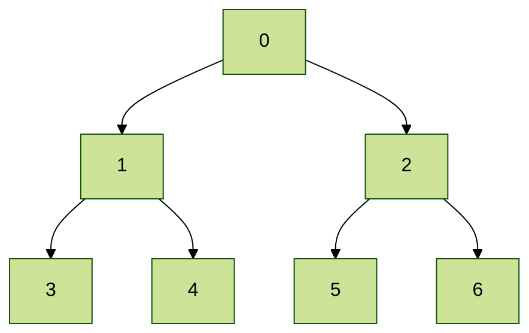

### Q. Program to get K smallest numbers from a given stream of numbers

#### Special DS

Heaps

### opertations supperted

- find-max (or find-min): find a maximum item of a max-heap, or a minimum item of a min-heap, respectively (a.k.a. peek)
- insert: adding a new key to the heap (a.k.a., push)
- extract-max (or extract-min): returns the node of maximum value from a max heap [or minimum value from a min heap] after removing it from the heap (a.k.a., pop)
- delete-max (or delete-min): removing the root node of a max heap (or min heap), respectively
- replace: pop root and push a new key. This is more efficient than a pop followed by a push, since it only needs to balance once, not twice, and is appropriate for fixed-size heaps.

*Approach:* if you want K smallest numbers, then go for max heap, whenever the size of heap increases then remove the element from top.
2 things can happen:

- incoming is greater than root: post heapify, this very element comes back to the top, and get removed due to size impact.
- incoming is smaller than root: post heapify, this element goes somewhere and max among all values comes to the top, and get removed due to size impact. there by preserving the smaller numbers intact.

```java
import java.util.PriorityQueue;

public class PriorityQueueUsage {
   /*
    * Program to get K smallest numbers from a given stream of numbers
    */

   public static void main(String[] args) {
       int[] ints = {10,0,30,4,5,6,8,9};
       int k = 4;
       for (Integer integer : ints) {
           System.out.print(integer+"  ");
       }
       System.out.println();

       PriorityQueue<Integer> maxHeap = new PriorityQueue<Integer>(2,(a,b)-> b-a);
       for (Integer integer : ints) {
           System.out.println(integer+" inserted ");
           maxHeap.offer(integer);
           System.out.println(maxHeap.toString());
          if (maxHeap.size()>k) {
               System.out.println(maxHeap.remove()+" removed ");
          } 
          System.out.println(maxHeap.toString());
          System.out.println();
       }
       while (!maxHeap.isEmpty()) {
           System.out.print(maxHeap.poll()+"  ");
       }
       System.out.println();
   }
}

```

### Q. Find the maximum element in the given range

### Q. Find the sum of elements in the given range of an array

#### Special DS

   Segmented tree.

Segment Trees can be used to solve Range Min/Max & Sum Queries and Range Update Queries in O (log n) time.

##### Applications of a Segment Tree

- Finding range sum/product, range max/min, prefix sum/product, etc
- Computational geometry
- Geographic information systemsStatic and Dynamic RMQ (Range Minimum Query)Storing segments in an arbitrary manner

#### Working

Basically, a Segment Tree has only three operations:

- Building Tree: in this step, we create the structure of the segment tree variable and initialise it
- Updating Tree: during this step, we change the tree by updating the value in the array at a point or over an interval
- Querying Tree: we may use this operation to run a range query on the array

In a Segment Tree, the array is stored at the leaves of the tree, while the internal nodes store information about segments represented by its children. The internal nodes are formed in a bottom-up manner by merging the information from its children nodes.

#### Segment Tree Class

```java
class SegmentTree {
      int[] tree;
      int size;
 
      SegmentTree(int[] array) {
          size = array.length;
          tree = new int[2 * size];
          buildTree(array, 0, 0, size - 1);
      }
}
```

Note the size of the segment tree is 2 times the array length.Take a look at the complete binary tree then,



If there are x nodes at leaf then x/2 on the level higher and x/4 above that it goes on until you have a single root node on top.

So this becomes mathematically as

```Text
With x nodes at leaf level

The total number of nodes involved in the segment tree is 4*n.
The total number of levels is log n and starting from one node at the first level, the number of nodes gets doubled at every level. 
So, total number of nodes = 1+2+4+8+....+2^(log n) = 2^(logn + 1) -1 < 4n.
```

##### To build the tree

Each element in the Segment tree  will be , where  is the node’s index, and the leaf node represents the elements in the array .

```java
private void buildTree(int[] array, int treeIndex, int left, int right) {
   if (left == right) {
       //base case, that is, filling in the leaf nodes.
       tree[treeIndex] = array[left];
       return;
   }
   int mid = left + (right - left) / 2;
   buildTree(array, 2 * treeIndex + 1, left, mid);
   buildTree(array, 2 * treeIndex + 2, mid + 1, right);
   //NOTE: this will store the info you want it do, in this case i am taking min
   // it can be sum or max or anything that you want this segment tree to do.
   tree[treeIndex] = Math.min(tree[2 * treeIndex + 1], tree[2 * treeIndex + 2]);
}
```

Initial call to do this:

```java
buildTree(array, 0, 0, size - 1);
```

#### To query

The range queries can be served in O(long(n)).

```java

private int query(int treeIndex, int left, int right, int queryLeft, int queryRight) {
   if (queryLeft <= left && right <= queryRight)
       return tree[treeIndex];
   int mid = left + (right - left) / 2;
   int minValue = Integer.MAX_VALUE;
   if (queryLeft <= mid)
       minValue = Math.min(minValue, query(2 * treeIndex + 1, left, mid, queryLeft, queryRight));
   if (queryRight > mid)
       minValue = Math.min(minValue, query(2 * treeIndex + 2, mid + 1, right, queryLeft, queryRight));
   return minValue;
}

int query(int left, int right) {
   return query(0, 0, size - 1, left, right);
}

```

#### To update the date at given index in an index tree.

go and update the value at the index and update the remaining values on the backtracking path.
Exactly same logic as the case of creation (Building) of the segmented tree.

```java

private void updateUtil(int treeIndex, int left, int right, int index, int val) {
   if (left == right) { // Leaf node
       tree[treeIndex] = val;
       return;
   }

   int mid = left + (right - left) / 2;

   if (index <= mid)
       updateUtil(2 * treeIndex + 1, left, mid, index, val);
   else
       updateUtil(2 * treeIndex + 2, mid + 1, right, index, val);
   
   tree[treeIndex] = Math.min(tree[2 * treeIndex + 1], tree[2 * treeIndex + 2]);
}

public void update(int index, int val) {
   updateUtil(0, 0, size - 1, index, val);
}

```

## Binary Indexed Tree or Fenwick Tree

Binary Indexed Tree also called Fenwick Tree provides a way to represent an array of numbers in an array, allowing prefix sums to be calculated efficiently.

For example, an array is [2, 3, -1, 0, 6] the length 3 prefix [2, 3, -1] with sum 2 + 3 + -1 = 4).

A Fenwick tree, also called a binary indexed tree (BIT), is a data structure that can efficiently update elements and calculate range sums on a list of numbers.

It is often used for storing frequencies and manipulating cumulative frequency tables.

Consider the following problem:
There are n boxes that undergo the following queries:

- add marble to box i
- sum marbles from box k to box l

The naive solution has time complexity of O(1) for query 1 and O(n) for query

A cumulative frequency can be represented as a sum of sets of sub frequencies.

Given an array 𝑎[], and two types of operations are to be performed on it.Change the value stored at an index i. (This is called a point update operation)Find the sum of a prefix of length k. (This is called a range sum query)

int freq[] = {2, 1, 1, 3, 2, 3, 4, 5, 6, 7, 8};

### For construction of Tree

step by step isolate the last set bits(LSB) and add the value to those indices.

example:

```txt
say we want to update the index 13
then 
binary for 13 = 1101
first iteration: LSB = 1, so add 1 to 13 and add the value at 14 index as well
second iteration: 14(1110): LSB=2, so add 2 to 14 and add the value at 16 index as well
third iteration: 16(10000): LSB=16, so add 16 to 16 and add the value at 32 index as well

this goes on until the LSB<N (the size of given array)
```

for the index being 1 we shall add this number to indeces
<br>i= 1 -i= -1 i&-i= 1
<br>i= 10 -i= -10 i&-i= 10
<br>i= 100 -i= -100 i&-i= 100
<br>i= 1000 -i= -1000 i&-i= 1000
<br>
<br>for the index being 2 we shall add this number to indeces
<br>i= 10 -i= -10 i&-i= 10
<br>i= 100 -i= -100 i&-i= 100
<br>i= 1000 -i= -1000 i&-i= 1000
<br>
<br>for the index being 3 we shall add this number to indeces
<br>i= 11 -i= -11 i&-i= 1
<br>i= 100 -i= -100 i&-i= 100
<br>i= 1000 -i= -1000 i&-i= 1000
<br>
<br>for the index being 4 we shall add this number to indeces
<br>i= 100 -i= -100 i&-i= 100
<br>i= 1000 -i= -1000 i&-i= 1000
<br>
<br>for the index being 5 we shall add this number to indeces
<br>i= 101 -i= -101 i&-i= 1
<br>i= 110 -i= -110 i&-i= 10
<br>i= 1000 -i= -1000 i&-i= 1000
<br>
<br>for the index being 6 we shall add this number to indeces
<br>i= 110 -i= -110 i&-i= 10
<br>i= 1000 -i= -1000 i&-i= 1000
<br>
<br>for the index being 7 we shall add this number to indeces
<br>i= 111 -i= -111 i&-i= 1
<br>i= 1000 -i= -1000 i&-i= 1000
<br>
<br>for the index being 8 we shall add this number to indeces
<br>i= 1000 -i= -1000 i&-i= 1000
<br>
<br>for the index being 9 we shall add this number to indeces
<br>i= 1001 -i= -1001 i&-i= 1
<br>i= 1010 -i= -1010 i&-i= 10
<br>
<br>for the index being 10 we shall add this number to indeces
<br>i= 1010 -i= -1010 i&-i= 10
<br>
<br>for the index being 11 we shall add this number to indeces
<br>i= 1011 -i= -1011 i&-i= 1
<br>i= 100 -i= -100 i&-i= 100
<br>i= 1000 -i= -1000 i&-i= 1000

```java
   private void constructBITree(int[] arr, int n) {
       for(int i=1; i<=n; i++) {
            BITree[i] = 0; 
       }
       for(int i = 0; i < n; i++) {
           updateBIT(n, i, arr[i]);
       }
   }

   public static void updateBIT(int n, int index, int val) { 
       index = index + 1; 
       while(index <= n) 
       { 
           BITree[index] += val; 
           index += index & (-index); 
       } 
   } 
```

Finally
The BI Tree becomes: [0, 2, 3, 1, 7, 2, 5, 4, 21, 6, 13, 8]

### To Query

get the value at that position and keep toggling the LSB and add value at that position until the number becomes 0.

```java
   int getSum(int index) 
   { 
       int sum = 0;
       index = index + 1; 
       while(index>0) 
       { 
           sum += BITree[index]; 
           index -= index & (-index); 
       } 
       return sum; 
   } 
```

To test the code you can use the below sample

```java
import java.util.Arrays;

public class Bitree {
   final static int MAX = 1000;      
   static int BITree[] = new int[MAX]; 
   public static void main(String[] args) {
       int arr[] = {2, 1, 1, 3, 2, 3, 4, 5, 6, 7, 8}; 
       Bitree tree = new Bitree(); 
       tree.constructBITree(arr, arr.length); 
       arr[3] = arr[3] + 6; 
       updateBIT(arr.length, 3, 6);  
   }
}
```
