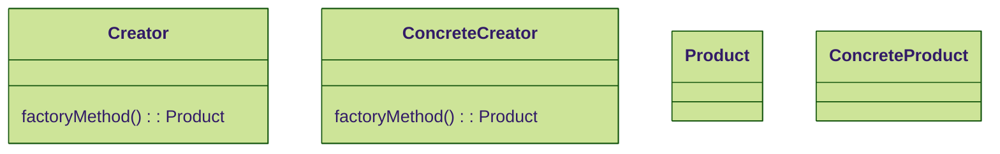
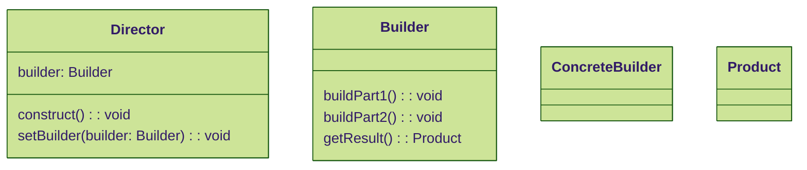



Certainly! Below, I will provide a more detailed explanation of each creational design pattern, along with a corresponding Mermaid script for a class diagram illustrating each pattern.

Singleton Pattern

The Singleton pattern ensures a class has only one instance and provides a global point of access to that instance. Here's a Mermaid script for a class diagram illustrating the Singleton pattern:

classDiagram
    class Singleton {
        static instance: Singleton
        Singleton()
        static getInstance(): Singleton
    }

In the class diagram:
The Singleton class has a private static variable instance of type Singleton, which is the single instance of the class.
The constructor Singleton() is private, preventing the direct creation of objects.
The method getInstance() is static and provides access to the single instance of the class.

Factory Method Pattern

The Factory Method pattern defines an interface for creating an object, but leaves the choice of its type to the subclasses, creating a factory for creating objects. Here's the corresponding Mermaid script for the class diagram:

In the class diagram:
The Creator class declares the factory method, which returns an object of type Product.
The ConcreteCreator class overrides the factory method to return an instance of ConcreteProduct.
Both Product and ConcreteProduct are the products created by the factory method.

Abstract Factory Pattern

The Abstract Factory pattern provides an interface for creating families of related or dependent objects without specifying their concrete classes. Here's the Mermaid script for the class diagram illustrating the Abstract Factory pattern:

```mermaid
%%{init: {'theme':'forest',"messageAlign": "center","flowchart": { 'useMaxWidth':false,
"htmlLabels": true
}}}%%
classDiagram
    class AbstractFactory {
        createProductA(): AbstractProductA
        createProductB(): AbstractProductB
    }
    class ConcreteFactory1 implements AbstractFactory
    class ConcreteFactory2 implements AbstractFactory
    class AbstractProductA 
    class ConcreteProductA1 implements AbstractProductA
    class ConcreteProductA2 implements AbstractProductA
    class AbstractProductB
    class ConcreteProductB1 implements AbstractProductB
    class ConcreteProductB2 implements AbstractProductB
```

In the class diagram:
The AbstractFactory interface declares methods for creating products of different types.
ConcreteFactory1 and ConcreteFactory2 implement the AbstractFactory interface, providing different implementations for creating products.
AbstractProductA and AbstractProductB are the abstract product types, which are implemented by concrete products such as ConcreteProductA1, ConcreteProductB2, and so on.

Builder Pattern

The Builder pattern separates the construction of a complex object from its representation, allowing the same construction process to create different representations. Here's the Mermaid script for the class diagram illustrating the Builder pattern:

In the class diagram:
The Director class is responsible for constructing the product using a Builder instance.
The Builder interface declares methods for building different parts of the product and obtaining the final product.
ConcreteBuilder implements the Builder interface, providing the specific implementation for building the product.
Product is the complex object being constructed.

Prototype Pattern

The Prototype pattern creates new objects by copying an existing object, known as the prototype. Here's the Mermaid script for the class diagram illustrating the Prototype pattern:

classDiagram
    class Prototype {
        clone(): Prototype
    }
    class ConcretePrototype1
    class ConcretePrototype2

In the class diagram:
The Prototype interface declares a method for cloning the object.
ConcretePrototype1 and ConcretePrototype2 are concrete classes that implement the Prototype interface, providing their own cloning behavior.

These class diagrams visually represent the structure and relationships of each creational design pattern, providing a clear understanding of their implementations.