Application architecture patterns

*   Monolithic architecture
*   Microservice architecture

Decomposition

*   Decompose by business capability
*   Decompose by subdomain
*   Self-contained Service
*   Service per team

Refactoring to microservices

*   Strangler Application
*   Anti-corruption layer

Data management

*   Database per Service
*   Shared database
*   Saga
*   Command-side replica
*   API Composition
*   CQRS
*   Domain event
*   Event sourcing

Transactional messaging

*   Transactional outbox
*   Transaction log tailing
*   Polling publisher

Testing

*   Service Component Test
*   Consumer-driven contract test
*   Consumer-side contract test

Deployment patterns

*   Multiple service instances per host
*   Service instance per host
*   Service instance per VM
*   Service instance per Container
*   Serverless deployment
*   Service deployment platform

Cross cutting concerns

*   Microservice chassis
*   Service Template
*   Externalized configuration

Communication style

*   Remote Procedure Invocation
*   Messaging
*   Domain-specific protocol
*   Idempotent Consumer

External API

*   API gateway
*   Backend for front-end

Service discovery

*   Client-side discovery
*   Server-side discovery
*   Service registry
*   Self registration
*   3rd party registration

Reliability

*   Circuit Breaker

Security

*   Access Token

Observability

*   Log aggregation
*   Application metrics
*   Audit logging
*   Distributed tracing
*   Exception tracking
*   Health check API
*   Log deployments and changes

UI patterns

*   Server-side page fragment composition
*   Client-side UI composition

Sure, here are some brief notes on microservices design patterns along with appropriate Mermaid scripts to illustrate them:

Microservices Design Patterns

Gateway Aggregation Pattern:
   This pattern involves using an API gateway to aggregate various microservices into a single endpoint for clients.

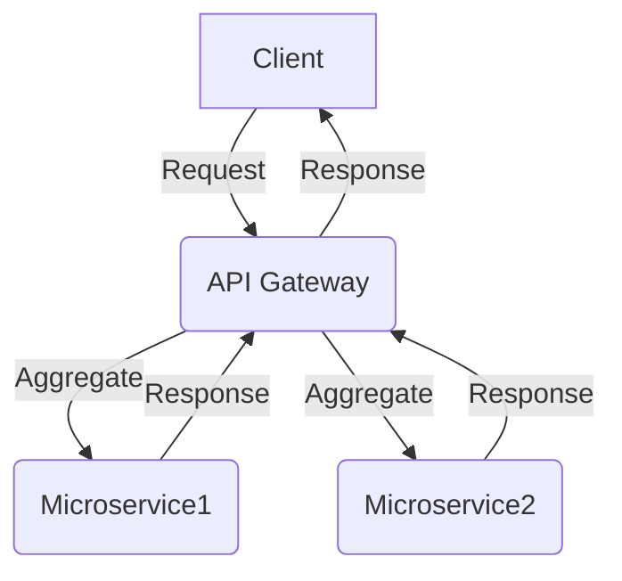

Saga Pattern:
   The saga pattern is used to manage distributed transactions across multiple microservices by orchestrating a sequence of local transactions.

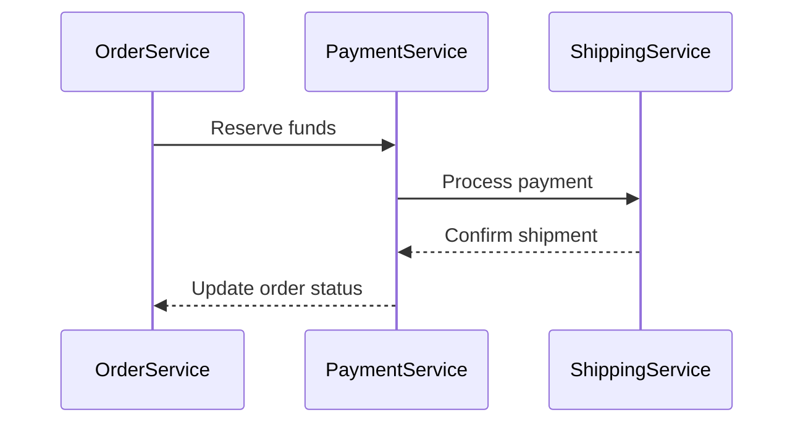
Event Sourcing Pattern:
   In this pattern, changes to the state of a system are captured as a sequence of events.

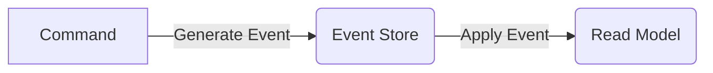

CQRS Pattern (Command Query Responsibility Segregation):
   CQRS separates the command and query responsibilities, allowing for different models to be optimized for reads and writes.
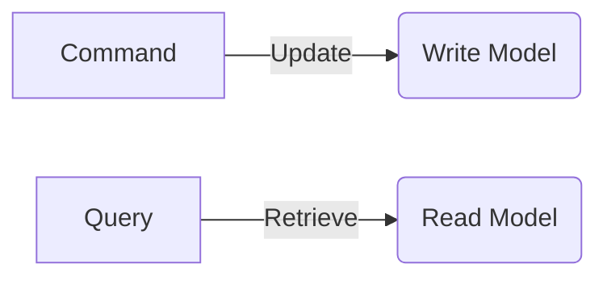

Service Registry Pattern:
   This pattern involves using a service registry to keep track of available services in a microservice architecture. It allows services to dynamically discover and communicate with each other.
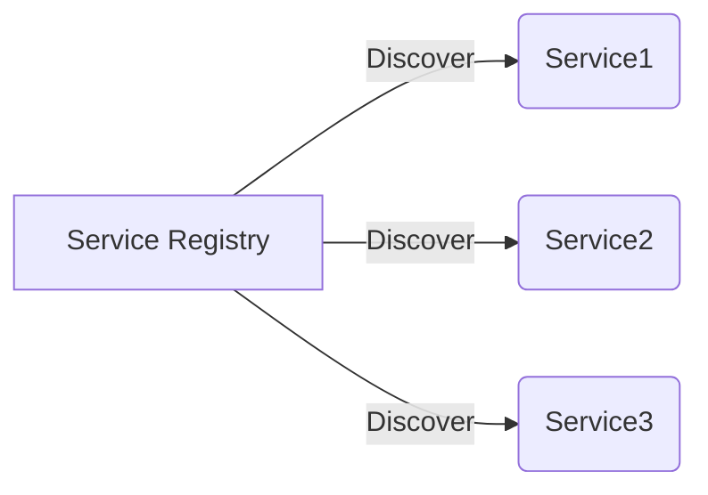

Circuit Breaker Pattern:
   The circuit breaker pattern is used to handle failures and prevent cascading failures in a microservice architecture. It provides a mechanism to detect and handle failures in remote service calls.
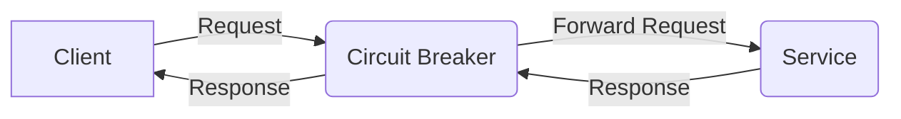
Event-Driven Architecture:
   In this pattern, services communicate with each other through events. Events are used to trigger actions and propagate changes across the system. This pattern enables loose coupling and scalability.
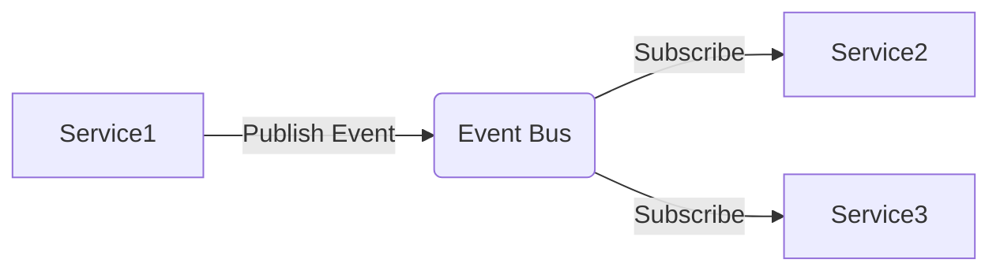
API Gateway Pattern:
   The API gateway pattern acts as a single entry point for clients to access multiple microservices. It provides a unified interface and handles tasks such as authentication, rate limiting, and request routing.
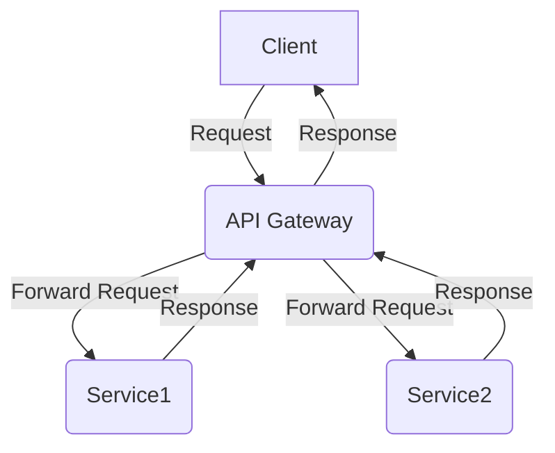
Saga Pattern:
   The saga pattern is used to manage distributed transactions across multiple microservices. It orchestrates a sequence of local transactions and ensures consistency in the overall transaction.
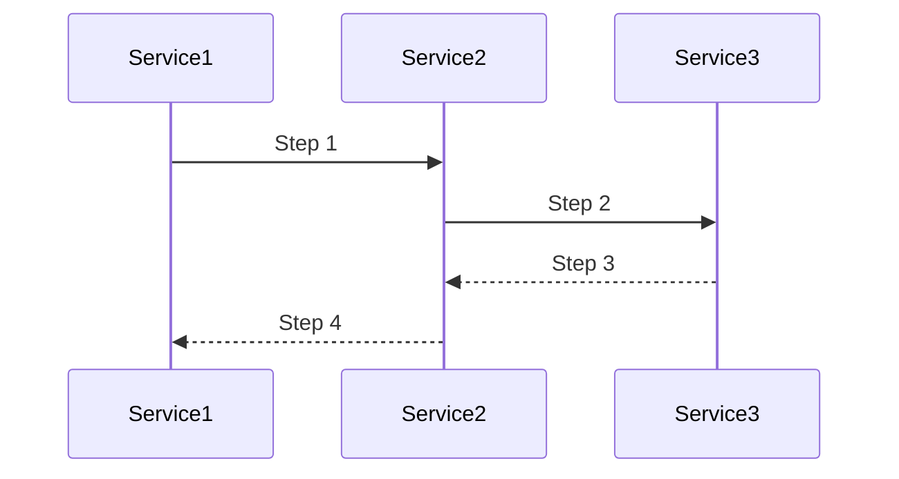
Database per Service Pattern:
   In this pattern, each microservice has its own dedicated database. This allows services to have independent data models and enables better scalability and autonomy.
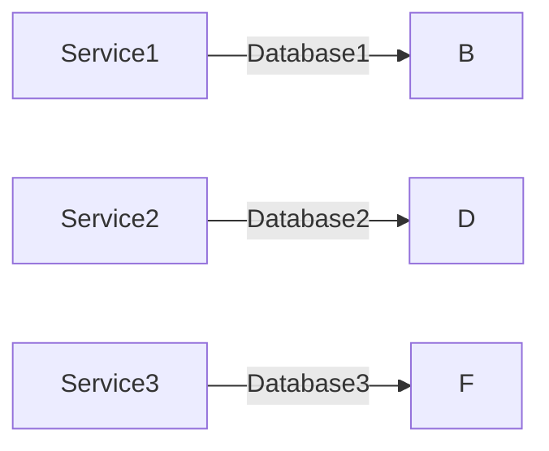
Command Query Responsibility Segregation (CQRS) Pattern:
   CQRS separates the read and write operations in a microservice architecture. It allows for different models to be optimized for reads and writes, improving performance and scalability.

Distributed Tracing:
   Distributed tracing is a pattern that allows you to trace requests as they flow through a distributed system. It helps in understanding the performance and behavior of individual microservices. 
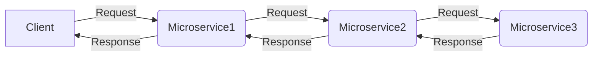
Health Check API:
   The health check API pattern involves implementing an API endpoint that provides information about the health of a microservice. It helps in monitoring the availability and status of individual microservices. 
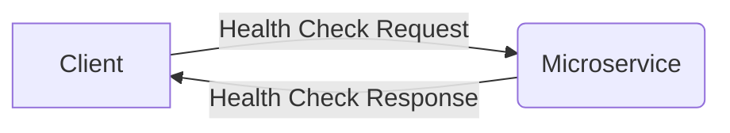
Log Aggregation:
   Log aggregation is a pattern that involves collecting and centralizing logs from multiple microservices. It helps in troubleshooting and analyzing the behavior of the system as a whole. 
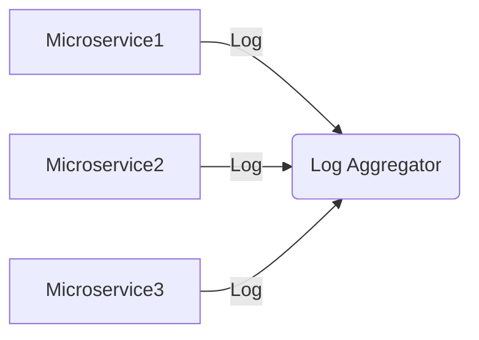
Audit Logging:
   Audit logging is a pattern that involves capturing and storing logs for auditing purposes. It helps in tracking and monitoring the activities and changes within a microservice architecture. 
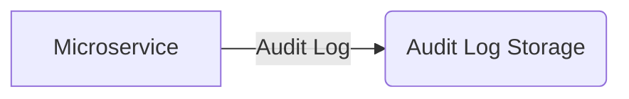