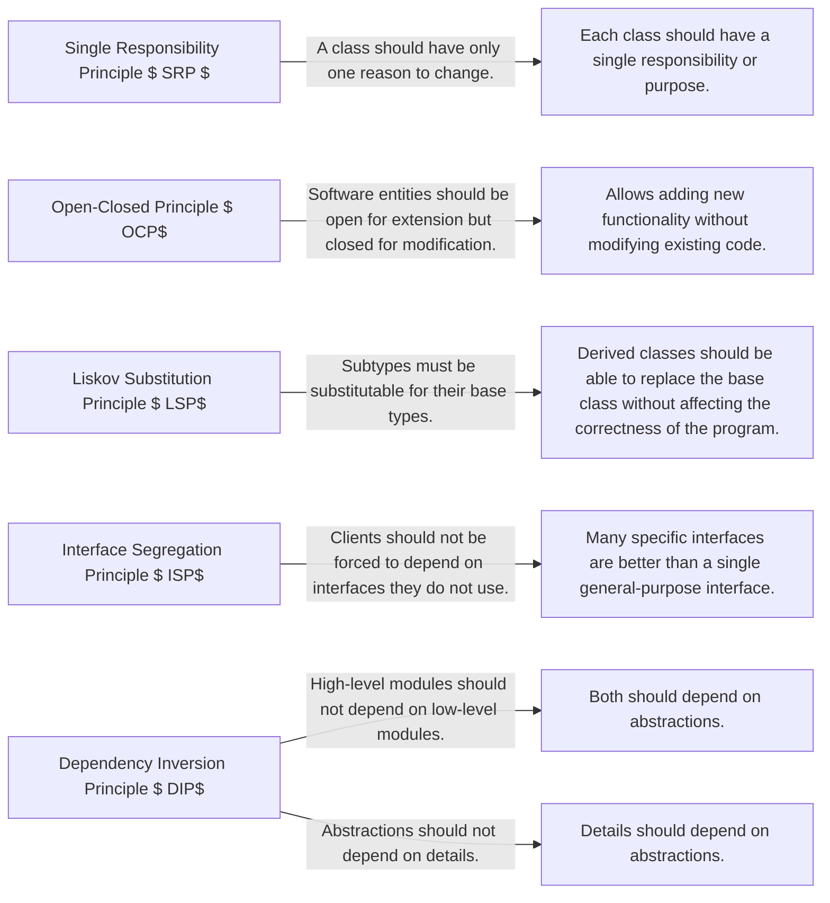

SOLID Principles of Object-Oriented Design

Single Responsibility Principle $ SRP$ :
   A class should have only one reason to change.
   Each class should have a single responsibility or purpose.
   Helps in making classes more focused and easier to maintain.

Open-Closed Principle $ OCP$ :
   Software entities $ classes, modules, functions$  should be open for extension but closed for modification.
   Allows adding new functionality without modifying existing code.
   Achieved through the use of abstractions, interfaces, and inheritance.

Liskov Substitution Principle $ LSP$ :
   Subtypes must be substitutable for their base types.
   Derived classes should be able to replace the base class without affecting the correctness of the program.
   Ensures that inheritance is used correctly and avoids unexpected behavior.

Interface Segregation Principle $ ISP$ :
   Clients should not be forced to depend on interfaces they do not use.
   Many specific interfaces are better than a single general-purpose interface.
   Promotes the idea of smaller, more focused interfaces.

Dependency Inversion Principle $ DIP$ :
   High-level modules should not depend on low-level modules. Both should depend on abstractions.
   Abstractions should not depend on details. Details should depend on abstractions.
   Encourages loose coupling and promotes the use of dependency injection.

These principles help in designing software that is modular, maintainable, and flexible. By following these principles, you can create code that is easier to understand, test, and extend.

I hope these notes on SOLID principles are helpful to you! Let me know if you have any further questions.