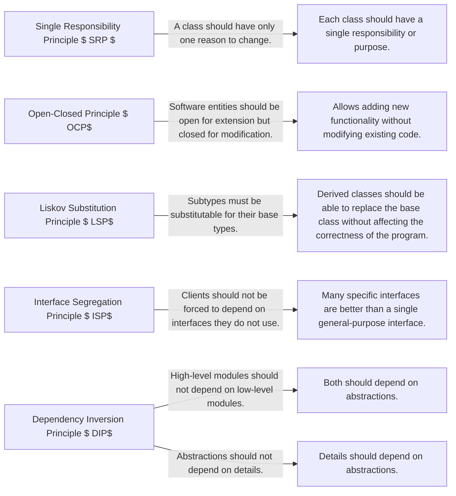

## SOLID Principles



SOLID Principles of Object-Oriented Design

Single Responsibility Principle $ SRP$ :
   A class should have only one reason to change.
   Each class should have a single responsibility or purpose.
   Helps in making classes more focused and easier to maintain.

Open-Closed Principle $ OCP$ :
   Software entities $ classes, modules, functions$  should be open for extension but closed for modification.
   Allows adding new functionality without modifying existing code.
   Achieved through the use of abstractions, interfaces, and inheritance.

Liskov Substitution Principle $ LSP$ :
   Subtypes must be substitutable for their base types.
   Derived classes should be able to replace the base class without affecting the correctness of the program.
   Ensures that inheritance is used correctly and avoids unexpected behavior.

Interface Segregation Principle $ ISP$ :
   Clients should not be forced to depend on interfaces they do not use.
   Many specific interfaces are better than a single general-purpose interface.
   Promotes the idea of smaller, more focused interfaces.

Dependency Inversion Principle $ DIP$ :
   High-level modules should not depend on low-level modules. Both should depend on abstractions.
   Abstractions should not depend on details. Details should depend on abstractions.
   Encourages loose coupling and promotes the use of dependency injection.

These principles help in designing software that is modular, maintainable, and flexible. By following these principles, you can create code that is easier to understand, test, and extend.

## other important principles

```mermaid!
graph LR
    DRY["Don't Repeat Yourself (DRY)"] --> |Abstract Duplication| DuplicationShouldBeAbstracted
    LoD["Law of Demeter"] --> |Talk to related classes| OnlyTalkToRelatedClasses
    HP["Hollywood Principle"] --> |Don't call us, we'll call you| DontCallUsWellCallYou
    YAGNI["You Ain't Gonna Need It"] --> |Code what you need now| OnlyCodeWhatYouNeedNow
    KISS["Keep It Simple, Stupid"] --> |Favor clarity over cleverness| FavorClarityOverCleverness
    CoC["Convention Over Configuration"] --> |Defaults cover 90% of uses| DefaultsCover90PercentOfUses
    Encapsulation --> |What happens in Vegas...| WhatHappensInVegas
    DBC["Design By Contract"] --> |Write tests| AndThenWriteTests
    FBC["Avoid Fragile Base Class"] --> |Treat Base like a public API| TreatBaseLikeAPublicAPI
    CCP["Common Closure Principle"] --> |Classes change together| ClassesThatChangeTogetherStayTogether
``````

Don't Repeat Yourself (DRY): Duplic­ation should be abstracted. This principle emphasizes the need to avoid redundant code by abstracting common functionality into reusable components.

Law of Demeter: Only talk to related classes. This principle suggests that an object should only interact with its immediate "friends" and not reach through the internal details of other objects.

Hollywood Principle: "­Don't call us, we'll call you". This principle encourages a design where low-level components are called by high-level components, but the high-level components are not dependent on the low-level components.

You Ain't Gonna Need It: Only code what you need now. This principle advises against adding functionality until it is deemed necessary to avoid unnecessary complexity.

Keep It Simple, Stupid (KISS): Favor clarity over cleverness. This principle advocates for simplicity and clarity in design over unnecessary complexity or cleverness.

Convention Over Config­uration: Defaults cover 90% of uses. This principle suggests that a framework should make assumptions about the best configuration based on conventions, reducing the need for explicit configuration.

Encaps­ulation: What happens in Vegas... This principle encapsulates the internal state of an object and hides its implementation details from the outside world.

Design By Contract: And then write tests. This principle involves defining formal, precise, and verifiable interface specifications for software components, and then using these contracts to ensure correctness.

Avoid Fragile Base Class: Treat Base like a public API. This principle emphasizes treating the base classes as though they are a public API, ensuring that changes to the base classes do not break subclasses.

Common Closure Principle: Classes that change together, stay together. This principle suggests that classes that are likely to change together should be encapsulated together.