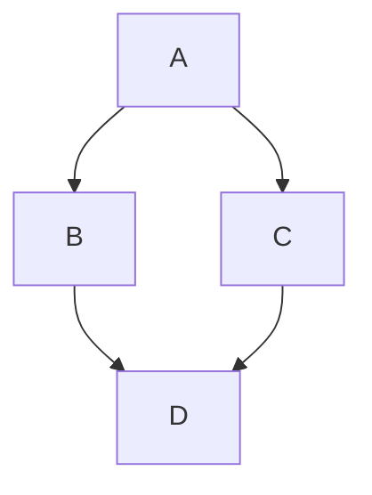
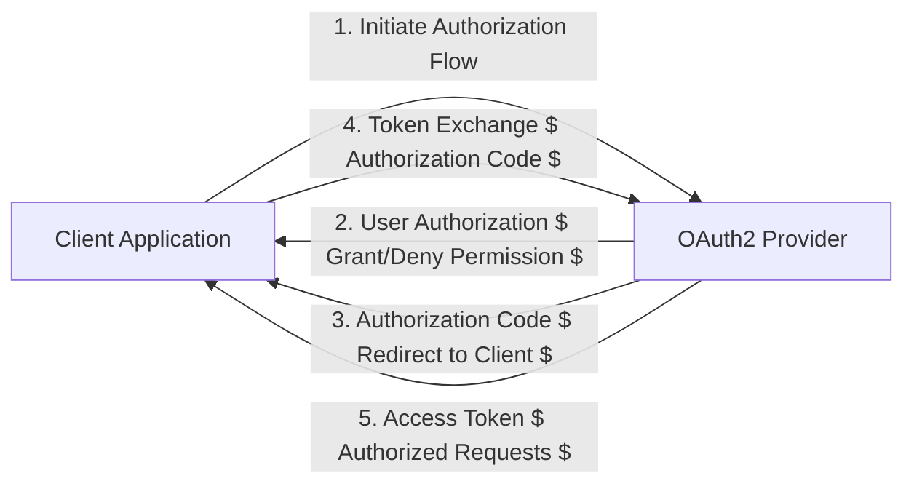

## Functional requirements (FR)

- _Add functional requirements here._

## Non-functional requirements (NFR)

- _Add non‑functional requirements here._

OAuth2

```mermaid!
graph TD;
    A-->B;
    A-->C;
    B-->D;
    C-->D;
```

```mermaid!
graph LR;
A[Client Application]-->|1. Initiate Authorization Flow| B[OAuth2 Provider];
    B-->|2. User Authorization $ Grant/Deny Permission $|A;
    B -->|3. Authorization Code $ Redirect to Client $ |A;
     A -->|4. Token Exchange $ Authorization Code $| B;
    B -->|5. Access Token $ Authorized Requests $| A;
```
